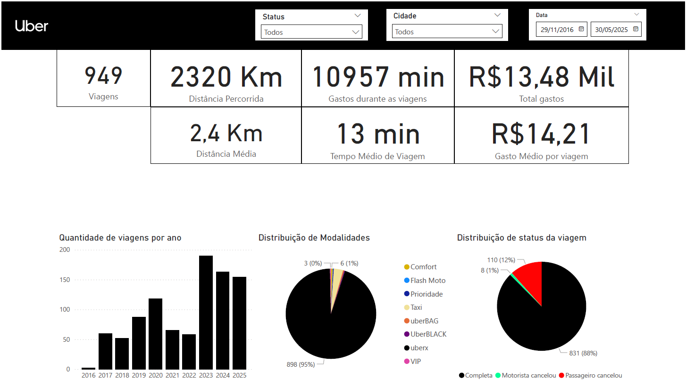

# Sobre o projeto

Este é um projeto na qual tem o intuito de analisar os meus dados referente a viagens durante quase 9 anos de uso da Uber.
Obs: Os fonte dos dados foram retirados do projeto por se tratar de dados pessoais, deixei os dados com informações publicas e que não identifiquem pessoas.

# Tecnologias utilizadas

- Python
- Pandas
- Power BI

# Como executar o projeto

- Clone ou baixe o repositório
- Baixe seus dados da Uber
- Coloque dentro da pasta do projeto
- Execute o comando `python -m venv .venv` para criar um ambiente virtual
- Ative o ambiente virtual:
  - No Windows: `.venv\Scripts\activate`
  - No Linux/Mac: `source .venv/bin/activate`
- Execute o comando `pip install -r requirements.txt` para instalar as dependências
- Delete o arquivo `final.xlsx` caso exista
- Execute o arquivo `main.ipynb` para gerar o arquivo `final.xlsx`
- Abra o arquivo `dashboard.pbix` no Power BI
- Clique em "Atualizar" para carregar os dados

## Dashboard

